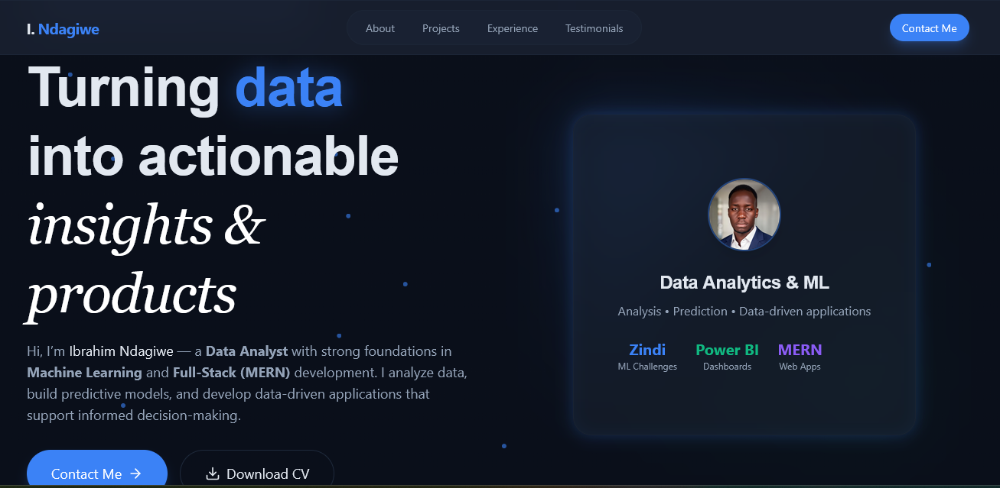
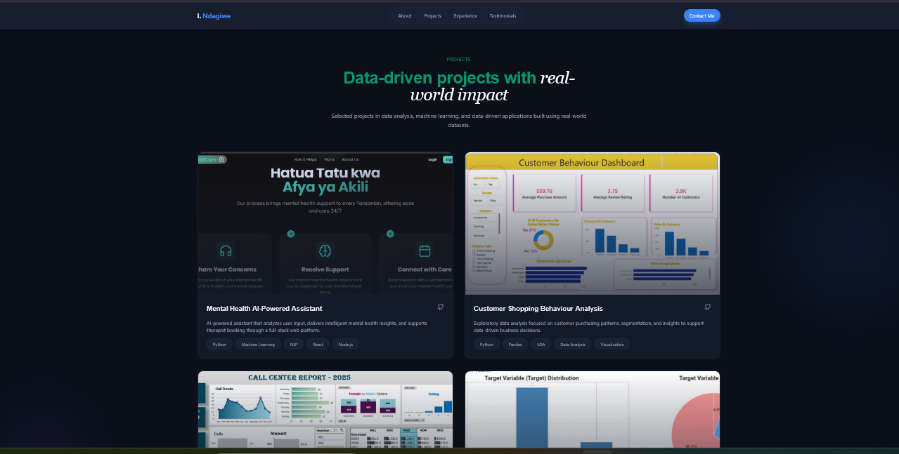
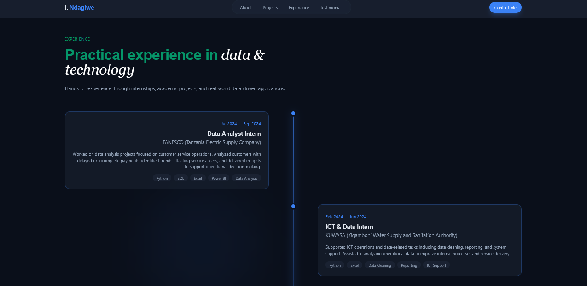

# 🚀 Data Science & Machine Learning Portfolio

A modern, responsive **React portfolio** showcasing my work as a **Data Scientist & Machine Learning Engineer**, with strong foundations in **full-stack development (MERN)**.  
Designed to highlight real-world projects, technical skills, and professional experience in a clean, recruiter-friendly way.

---

## 🧠 About the Portfolio

This portfolio is built to **bridge data science and software engineering**, demonstrating how machine learning models, data analysis, and scalable web applications come together in production-ready systems.

**Key goals of this portfolio:**
- Showcase **data science & ML projects**
- Highlight **real-world problem solving**
- Demonstrate **clean UI, UX, and responsive design**
- Make it easy for **recruiters and clients** to explore my work

---

## 🖥 Portfolio UI Preview

### Desktop Experience
> Clean layout, glassmorphism UI, and clear project presentation


*Hero section with professional branding and specialization focus*


*Projects section with GitHub links and technology stack*


*Professional experience timeline*

---

### 📱 Mobile Responsive View
> Fully responsive across all screen sizes


---

## 🌐 Live Portfolio

[](https://your-portfolio-link.com)


## ✨ Features

- ⚛️ **React + Vite** modern frontend stack  
- 🎨 **Tailwind CSS** with glassmorphism & animations  
- 📊 Dedicated **Data Science & ML project section**  
- 🔗 **GitHub integration** (repo links per project)  
- 📬 **EmailJS contact form** (no backend required)  
- 📱 Fully **responsive design**  
- 🌙 Elegant dark UI with smooth transitions  

---

## 🛠 Tech Stack

### Frontend
- **React**
- **Vite**
- **Tailwind CSS**
- **Lucide Icons**

### Data Science & ML (Showcased Projects)
- Python
- Pandas, NumPy
- Scikit-learn
- TensorFlow / PyTorch
- Data Visualization

### Tooling & Deployment
- Git & GitHub
- EmailJS
- Vercel / Netlify

---

## 📂 Project Structure

```text
├── public/
│   └── screenshots/
│       ├── hero.png
│       ├── projects.png
│       ├── experience.png
│       └── mobile.png
├── src/
│   ├── components/
│   ├── sections/
│   ├── pages/
│   └── styles/
├── README.md
└── package.json
